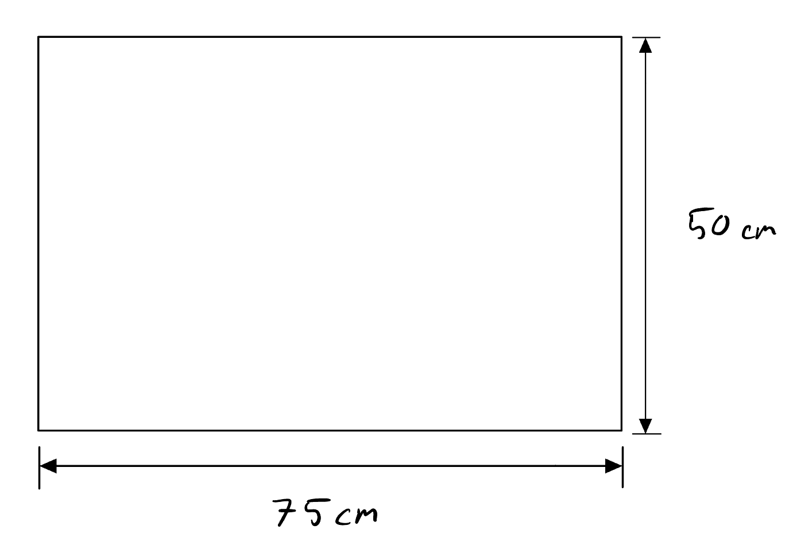
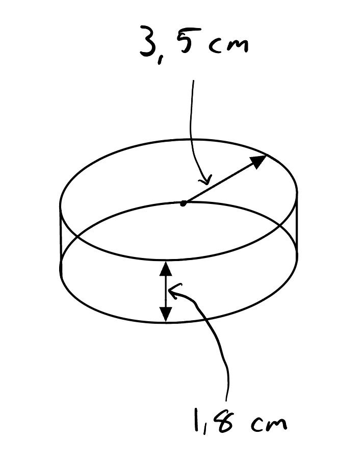
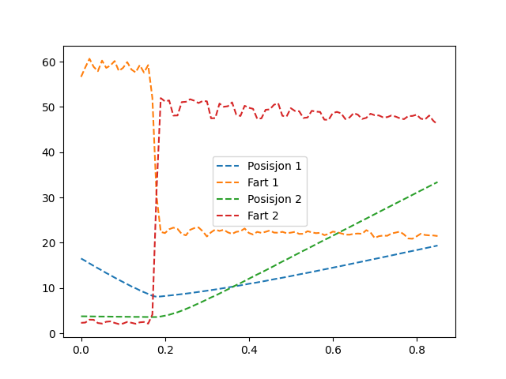

Tittel: Lab 1, Kollisjoner i 2D
Dato: 19/09/2024
Navn: Nikolai G. Borbe, Karl-Arne Opkvitne

### Hensikt
Undersøke om bevegelsesmengde og mekanisk energi er bevart i kollisjoner der friksjon er neglisjerbar.

### Utstyr:
- Kamera: "Panasonic DMC-FZ200".
- Linse: "DC VARIO-ELMARIT 1:2.8/4.5-108 ASPH.".

1. Setter kamera instillinger til: 100fps HD MP4. 
2. Luftbord (Anslått friksjonsfritt)
3. 2 Pucker. (Puck 1 (uten stang) hadde vekt: 29.797g, Puck 2 (med stang) hadde vekt: 31.638g)

### Beskrivelse:

Vi har 2 pucker med henholdsvis masse $m_1=29.8 g$ og radius $r_1 = 3.5 cm$, og masse $m_2=31.6 cm$ og radius $r_2=3.5 cm$. Først målte vi de to puckene, for å kunne utføre beregninger ved å ta i bruk de teoretiske formlene.

For at friksjonskraften mellom bordet og pucken skulle bli minst mulig hadde vi et "luftbord", altså det ble pumpet luft opp gjennom små hull i bordet slik at kontakten mellom bordet og pucken blir minst mulig. 

### Resultater
(Se "ResultatKollisjon1.csv").
Tid: *s*.
x, y: *cm*.

### Analyse

### Konklusjon