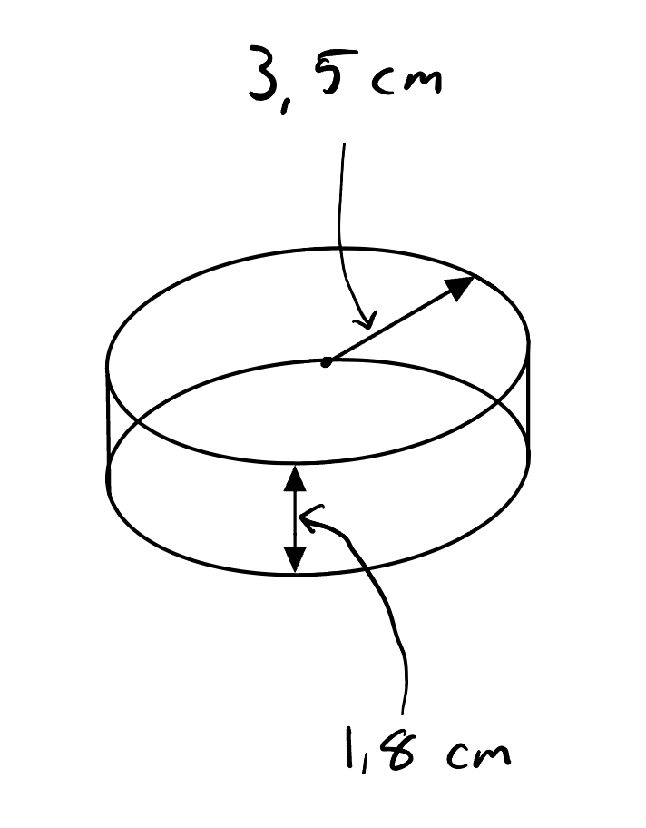

Tittel: Lab 1, Kollisjoner i 2D
Dato: 19/09/2024
Navn: Nikolai G. Borbe, Karl-Arne Opkvitne

### Hensikt
-> SKRIV INN HER

### Utstyr:
- Kamera: "Panasonic DMC-FZ200", ID: .
- Linse: "DC VARIO-ELMARIT 1:2.8/4.5-108 ASPH.", ID: .

1. Setter kamera instillinger til: 100fps HD MP4. Kamera: , Linse: .
2. Luftbord (Anslått friksjonsfritt)
3. 2 Pucker

### Beskrivelse:

Vi har 2 pucker med henholdsvis masse $m_1$ og radius $r_1$, og masse $m_2$ og radius $r_2$. Først målte vi de to puckene, for å kunne utføre beregninger ved å ta i bruk de teoretiske formlene.

